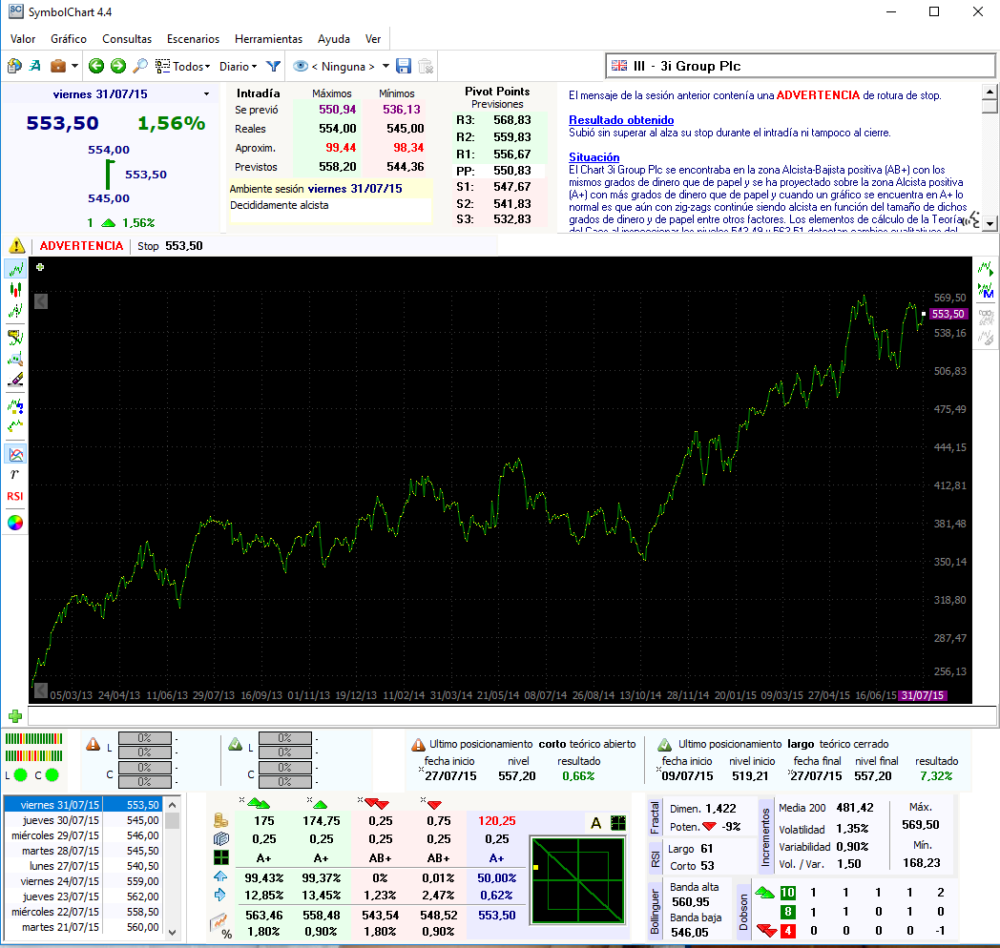

SymbolChart era un programa de análisis bursátil. Visualizaba el análisis de más de 1000 valores de diferentes bolsas de todo el mundo. El análisis era realizado por otro programa que actualizaba el servidor con los cálculos. SymbolChart se conectaba al servidor y bajaba los análisis nuevos permitiendo visualizarlos. Actualmente ya no está operativo.

El programa se realizó con Delphi 2007 Professional.

En este [enlace](https://mega.nz/#!zkFw1BpI!1EYcvAA2gx65FKQDM86Ve_-RCnA7jFpRHToa5Jmi6Yg) se puede encontrar el último instalador que estuvo disponible, por lo que es posible instalar el programa y ver como era.

Utiliza el código como quieras. 

